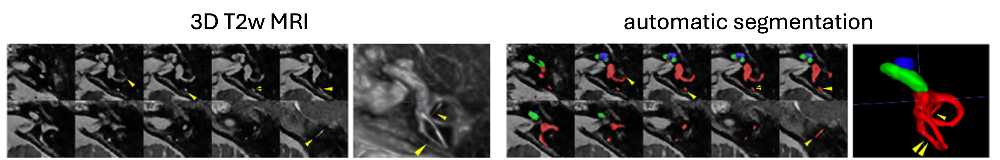

# InnerEar-Seg
Official repository for the paper "Deep Learning-Based Inner Ear Subregion Segmentation in 3D T2-Weighted MRI Using Label-Preserving Data Augmentation."

---

## Background
Inner ear segmentation supports the diagnosis and treatment planning of auditory-related disorders such as Meniere’s disease. However, manual annotation of inner ear structures on MR images is both time-consuming and labor-intensive. To address this limitation, we developed a deep learning method that takes T2-weighted MR images as input and segments the inner ear into three subregions: the cochlear basal turn, the cochlear mid-to-apical turn, and the vestibule including the semicircular canals.


## Installation

```bash
pip install -r requirements.txt
```

## Train

```bash
python train.py --train-dir [path/to/your/train/data/dir] --valid-dir [path/to/your/valid/data/dir] --log-dir [path/to/log/dir]
```

## Test

```bash
python test.py --test-dir [path/to/your/test/data/dir] --log-dir [path/to/log/dir]
```
